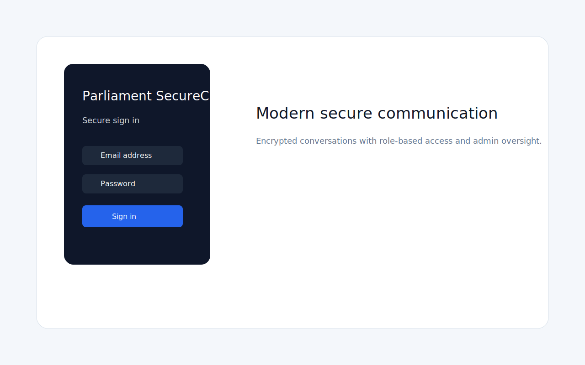
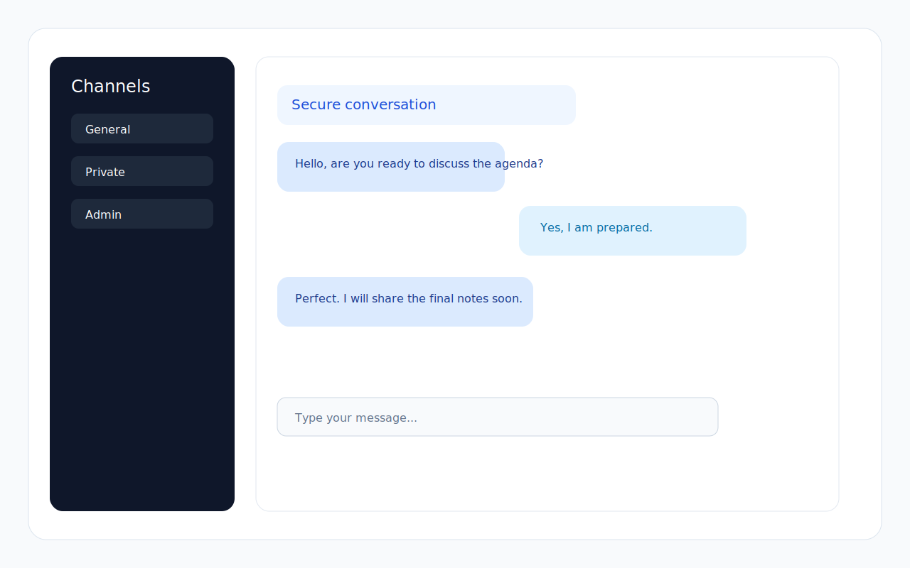
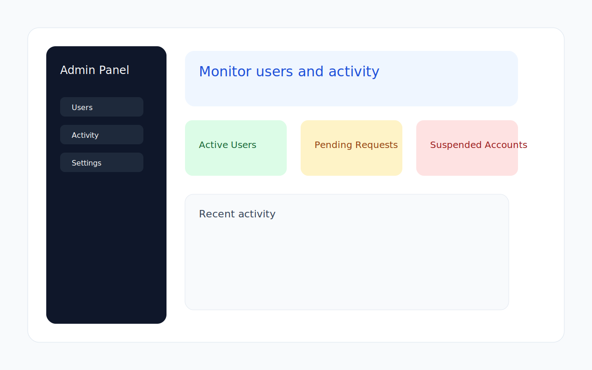

Parliament SecureChat

End-to-end encrypted messaging for the House of Peoples' Representatives of the FDRE


## Overview

Real-time secure messaging where the server never reads your messages. Each user holds a private ECDH key. The shared encryption secret is derived mathematically — it is never transmitted over the network. Built with React and FastAPI.


## Tech Stack

| Layer      | Technology                                      |
|------------|-------------------------------------------------|
| Frontend   | React, Vite, Tailwind CSS, Web Crypto API, WebSocket |
| Backend    | FastAPI, SQLite, bcrypt, JWT, Uvicorn           |


## Project Structure

parliament-chat/
├── backend/
│   ├── main.py                       # FastAPI app — routes, WebSocket, DB logic
│   └── requirements.txt              # Python dependencies
├── frontend/
│   ├── public/
│   │   ├── favicon.svg
│   │   ├── icons.svg
│   │   └── parliament-logo.png
│   ├── src/
│   │   ├── components/
│   │   │   ├── AdminDashboard.jsx    # Admin user management panel
│   │   │   ├── ChatRoom.jsx          # Main chat interface
│   │   │   ├── InactivityWarning.jsx # Auto-logout countdown modal
│   │   │   ├── LoginScreen.jsx
│   │   │   └── RegisterScreen.jsx
│   │   ├── crypto/
│   │   │   └── e2e.js                # ECDH key generation and AES-GCM encryption
│   │   ├── hooks/
│   │   │   ├── useAuth.js            # Authentication state and token management
│   │   │   ├── useInactivity.js      # Inactivity timer logic
│   │   │   └── useWebSocket.js       # WebSocket connection and message handling
│   │   ├── utils/
│   │   │   └── validation.js         # Input validation rules
│   │   ├── App.jsx
│   │   ├── App.css
│   │   ├── main.jsx
│   │   └── index.css
│   ├── index.html
│   ├── package.json
│   ├── vite.config.js
│   └── eslint.config.js
|
└── README.md
```

---

## Screenshots

**Login Screen**



**Chat Interface**



**Admin Dashboard**



---

## Setup

**Backend**

```bash
cd backend
pip install fastapi uvicorn cryptography python-multipart websockets bcrypt "python-jose[cryptography]"
python -m uvicorn main:app --reload
```

**Frontend**

```bash
cd frontend
pnpm install
pnpm run dev
```

The frontend runs on `http://localhost:5173` and the backend on `http://localhost:8000`.

**Default Admin Account**

```
Email:    admin@parliament.gov.et
Password: Admin@Parliament1
```

---

## How Encryption Works

```
Akotet  → private key (a) + public key (A) → uploads A to server
Shimelis → private key (b) + public key (B) → uploads B to server

Akotet sends to Shimelis:
  SharedKey = ECDH(a, B)    ← derived from Akotet's private key + Shimelis's public key

Shimelis receives:
  SharedKey = ECDH(b, A)    ← same key, derived independently

Server stores: "gAAAAABk7xPmQr..."  ← unreadable ciphertext only
```

Neither private key alone can decrypt anything. The server is completely blind to message content.

---

## Features

- ECDH end-to-end encryption (P-256 + AES-GCM)
- Auto logout after 2 minutes of inactivity
- Admin approval required before any account gains access
- Group channel, private DMs, and personal notes (chat with yourself)
- Edit and delete messages
- Dark and light mode
- Responsive layout for mobile, tablet, and desktop
- Admin dashboard with full activity log

---

## User Roles

| Role      | Access                                   |
|-----------|------------------------------------------|
| pending   | Registered, awaiting admin approval      |
| member    | Full chat access                         |
| admin     | User management and activity dashboard   |
| suspended | Blocked from the platform                |

---

## Validation Rules

| Field    | Rule                                                      |
|----------|-----------------------------------------------------------|
| Username | 2–20 characters, letters/numbers/underscore only          |
| Email    | Valid format with domain                                  |
| Phone    | 7–15 digits, international format                        |
| Password | Min 8 chars, requires uppercase, lowercase, number, and special character |

---

## Author

Akotet Shimelis — [github.com/akotet27](https://github.com/akotet27)
